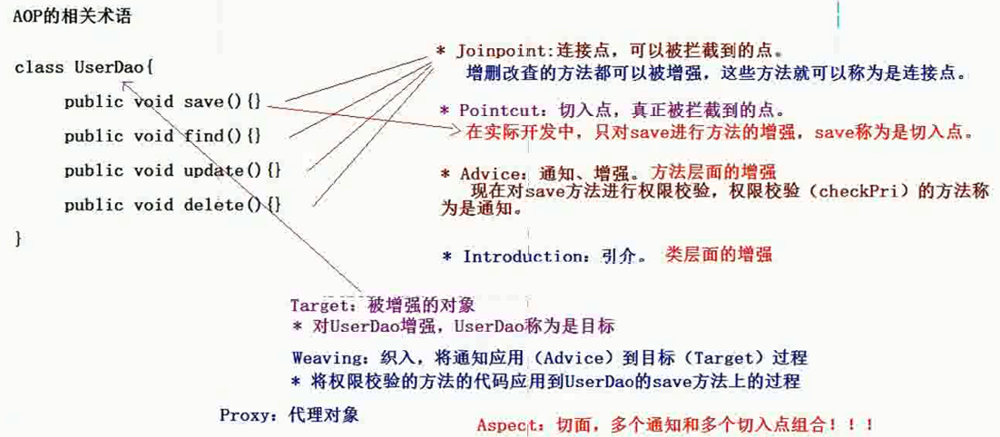

### Spring笔记
一、入门
1. 导入jar包
```
spring-framework-4.2.4.RELEASE\libs
spring-framework-3.0.2.RELEASE-dependencies\org.apache.commons\com.springsource.org.apache.commons.logging\1.1.1
spring-framework-3.0.2.RELEASE-dependencies\org.apache.log4j\com.springsource.org.apache.log4j\1.2.15
```
2. 入门xml配置
```xml
<?xml version="1.0" encoding="UTF-8"?>
<beans xmlns="http://www.springframework.org/schema/beans"
    xmlns:xsi="http://www.w3.org/2001/XMLSchema-instance"
    xsi:schemaLocation="
        http://www.springframework.org/schema/beans http://www.springframework.org/schema/beans/spring-beans.xsd">
	<bean id="UserService" class="com.itheima.spring.demo.UserServiceImpl"></bean>
</beans>
```
3. 接口和实现类
```java
public interface UserService {
	public void save();
}
//实现类
public class UserServiceImpl implements UserService {

	@Override
	public void save() {
		System.out.println("save方法");
	}
}
```
4. 测试类
```java
@Test
	public void demo2() {
		ApplicationContext applicationContext=new ClassPathXmlApplicationContext("applicationContext.xml");
		UserService userService=(UserService) applicationContext.getBean("UserService");
		userService.save();
	}
```
5. IOC：控制反转，将对象的创建权反转给了Spring。
 * DI：依赖注入，前提必须有IOC的环境，Spring管理这个类的时候将类的依赖的属性注入（设置）进来。
6. ApplicationContext的两个实现类
 * ClassPathXmlApplicationContext	：加载类路径下的配置文件
 * FileSystemXmlApplicationContext	：加载文件系统下的配置文件
7. Bean的生命周期的配置
```xml
	<bean id="UserService" class="com.itheima.spring.demo.UserServiceImpl" init-method="" destory-method=""></bean>
```
 * init-method		:Bean被初始化的时候执行的方法
 * destroy-method	:Bean被销毁的时候执行的方法（Bean是单例创建，工厂关闭）
8. Bean的作用范围的配置
 * scope	：Bean的作用范围
    * prototype	：多例模式。（Struts2和Spring整合一定会用到）
    * singleton	：默认的，Spring会采用单例模式创建这个对象。
    * request	：应用在web项目中，Spring创建这个类以后，将这个类存入到request范围中
    * session		：应用在web项目中，Spring创建这个类以后，将这个类存入到session范围中。
    * globalsession	：应用在web项目中，必须在porlet环境下使用。但是如果没有这种环境，相对于session。

```xml
	<bean id="UserService" class="com.itheima.spring.demo.UserServiceImpl" scope="singleton"></bean>
```
9. Spring的属性注入
  * 构造方法的属性注入
  ```java
  public class Car {
	private String name;
	private double price;
	public Car(String name, double price) {
		super();
		this.name = name;
		this.price = price;
	}
	@Override
	public String toString() {
		return "Car [name=" + name + ", price=" + price + "]";
	}
}
  ```
  ```xml
  <!-- spring的属性注入 ,构造方法的属性注入-->
  	<bean id="car" class="com.itheima.spring.demo.Car">
  		<constructor-arg name="name" value="CR7"/>
  		<constructor-arg name="price" value="300000"/>
  	</bean>
  ```
  * set方法的属性注入
  ```java
  public class Car2 {
	private String name;
	private double price;
	public String getName() {
		return name;
	}
	public void setName(String name) {
		this.name = name;
	}
	public double getPrice() {
		return price;
	}
	public void setPrice(double price) {
		this.price = price;
	}
	@Override
	public String toString() {
		return "Car2 [name=" + name + ", price=" + price + "]";
	}
}
```
```xml
<!-- spring的属性注入 ,set方法的属性注入 -->
	<bean id="car2" class="com.itheima.spring.demo.Car2">
		<property name="name" value="奔驰"/>
		<property name="price" value="150000"/>
	</bean>
```
 * Set方法设置对象类型的属性
 ```java
 public class Employee {
	private String name;
	private Car2 car2;
	public void setName(String name) {
		this.name = name;
	}
	public void setCar2(Car2 car2) {
		this.car2 = car2;
	}
	@Override
	public String toString() {
		return "Employee [name=" + name + ", car2=" + car2 + "]";
	}
}
```
```xml
<!-- set方法的对象类型属性注入 -->
	<bean id="employee" class="com.itheima.spring.demo.Employee">
	<!-- value设置普通类型的属性,ref设置其他类的id或name -->
		<property name="name" value="CR7"/>
		<property name="car2" ref="car2"/>
	</bean>
```
 * p命名空间的属性注入
    * ``添加xmlns:p="http://www.springframework.org/schema/p"``
    * 普通类型的属性注入:
   ```xml
   <bean id="car2" class="com.itheima.spring.demo.Car2" p:name="宝马" p:price="400000"></bean>
   ```
    * 对象类型属性注入
    ```xml
    <bean id="employee" class="com.itheima.spring.demo.Employee" p:name="Jim" p:car2-ref="car2"></bean>
    ```
 * SpEL的属性注入
    * SpEL：Spring Expression Language，Spring的表达式语言。
    * 语法：#{SpEL}
  ```xml
  <!--普通数据类型-->
  <bean id="car2" class="com.itheima.spring.demo.Car2">
		<property name="name" value="#{'保时捷'}"/>
		<property name="price" value="#{4000*100}"/>
	</bean>
  ```
  ```xml
  <!--对象数据类型，用value代替ref-->
  <bean id="employee" class="com.itheima.spring.demo.Employee">
		<property name="name" value="Peter"/>
		<property name="car2" value="#{car2}"/>
	</bean>
  ```
  ```xml
  <!--SpEL与p命名空间相结合-->
  <bean id="car2" class="com.itheima.spring.demo.Car2" p:name="#{'五菱荣光'}" p:price="#{30000}"></bean>
  ```
  * 集合类型数据的注入
  ```java
  public class CollectionBean {
	private String[] arr;
	private List<String> list;
	private Map<String,String> map;
	public void setMap(Map<String, String> map) {
		this.map = map;
	}
	public void setList(List<String> list) {
		this.list = list;
	}
	public void setArr(String[] arr) {
		this.arr = arr;
	}
	@Override
	public String toString() {
		return "CollectionBean [arr=" + Arrays.toString(arr) + ", list=" + list + ", map=" + map + "]";
	}
}
```
```xml
<!--集合类型数据的注入 -->
	<bean id="collectionBean" class="com.itheima.spring.demo.CollectionBean">
  <!--数组数据的注入-->
  <property name="arr">
		<list>
			<value>1</value>
			<value>2</value>
			<value>3</value>
			<value>4</value>
		</list>
	</property>
	<!-- List集合的数据注入 -->
	<property  name="list">
	 	<list>
	 		<value>list1</value>
	 		<value>list2</value>
	 		<value>list3</value>
	 	</list>
	</property>
	<!-- Map集合的数据注入 -->
	<property name="map">
		<map>
			<entry key="a" value="A"/>
			<entry key="b" value="B"/>
			<entry key="c" value="C"/>
		</map>
	</property>
	</bean>
```
10. 分模块开发
  * 加载多个配置文件
  ```java
  ApplicationContext applicationContext=new ClassPathXmlApplicationContext("applicationContext.xml","applicationContext2.xml");
  ```
  ```java
  <import resource="applicationContext2.xml"/>
  ```

二、IOC注解开发
1. IOC入门
 * xml约束
```xml
<?xml version="1.0" encoding="UTF-8"?>
<beans xmlns="http://www.springframework.org/schema/beans"
    xmlns:xsi="http://www.w3.org/2001/XMLSchema-instance"
    xmlns:context="http://www.springframework.org/schema/context" xsi:schemaLocation="
        http://www.springframework.org/schema/beans http://www.springframework.org/schema/beans/spring-beans.xsd
        http://www.springframework.org/schema/context http://www.springframework.org/schema/context/spring-context.xsd">
</beans>
<!-- 使用IOC的注解开发,配置组件扫描,哪些包下的类使用IOC注解-->
<context:component-scan base-package="com.itheima.spring.demo"></context:component-scan>
```
 * 接口
```java
public interface UserDao {
	public void save();
}
```
 * 在实现类中添加注解
```java
@Component("UserDao") //相当于<bean id="UserDao" class="com.itheima.spring.demo.UserDaoImpl"></bean>
public class UserDaoImpl implements UserDao{
	@Override
	public void save() {
		System.out.println("调用UserDao的save方法");
	}
}
```
2. IOC注解的详解
 * @Component: 组件,修饰一个类，将这个类交给Spring管理
 * 衍生的注解
    * @Controller :web层
    * @Service    :service层
    * @Repository :dao层
```java
@Repository("UserDao") //相当于<bean id="UserDao" class="com.itheima.spring.demo.UserDaoImpl"></bean>
public class UserDaoImpl implements UserDao{
	@Override
	public void save() {
		System.out.println("调用UserDao的save方法");
	}
}
```

 *属性注入的注解
 * 普通属性:@value
 * 对象类型属性:@Autowired
    * xml配置
    ```
    <!-- 使用IOC的注解开发,配置组件扫描,哪些包下的类使用IOC注解-->
    <context:component-scan base-package="com.itheima.spring.demo"></context:component-scan>
    ```
    * 接口
    ```java
    public interface UserService {
	  public void save();
    }
    ```
    * 实现类
    ```java
    @Service("UserService")
    public class UserServiceImpl implements UserService{
    //属性注入  
	  @Autowired
	  private UserDao userDao;
	  @Override
	  public void save() {
		userDao.save();
		System.out.println("调用UserService的save方法");
 	   }
	}
	```
    ```
    //控制台的输出
    调用UserDao的save方法
    调用UserService的save方法
    ```
    * @Resource :完成对象类型的属性注入按照名字完成属性注入
    ```java
    @Service("UserService")
    public class UserServiceImpl implements UserService{
	 @Resource(name="UserDao")
	 private UserDao userDao;
	 @Override
	 public void save() {
		userDao.save();
		System.out.println("调用UserService的save方法");
		}
	}
    ```

 * 其他注解
    * @PostConstruct :相当于init-method
    * @PreDestory    :相当于destory-method
    * @Scope("prototype"/"singleton"/"request"/"session"/"globalsession")
 * xml和注解整合开发
    * 在没有扫描的情况下，使用属性注入的注解:@Resource,@Value,@Autowired
      ``<context:annotation-config/>``

三、AOP(面向切面编程--Aspect Oriented Programming)
1. AOP的相关术语
 
2. AOP入门
 * 导入jar包
  ```
  com.springsource.org.aspectj.weaver-1.6.8.RELEASE.jar
  com.springsource.org.aopalliance-1.0.0.jar
  spring-aop-4.2.4.RELEASE.jar
  spring-aspects-4.2.4.RELEASE.jar
  ```
  ```
  路径
  spring-framework-3.0.2.RELEASE-dependencies\org.aspectj\com.springsource.org.aspectj.weaver\1.6.8.RELEASE
  spring-framework-3.0.2.RELEASE-dependencies\org.aopalliance\com.springsource.org.aopalliance\1.0.0
  spring-framework-4.2.4.RELEASE\libs
  ```
  * 添加配置文件和AOP约束
  ```xml
  <beans xmlns="http://www.springframework.org/schema/beans"
    xmlns:xsi="http://www.w3.org/2001/XMLSchema-instance"
    xmlns:aop="http://www.springframework.org/schema/aop" xsi:schemaLocation="
        http://www.springframework.org/schema/beans http://www.springframework.org/schema/beans/spring-beans.xsd
        http://www.springframework.org/schema/aop http://www.springframework.org/schema/aop/spring-aop.xsd">
</beans>
  ```
  * 接口和实现类
  ```java
  public interface ProductDao {
	public void save();
	public void update();
	public void find();
	public void delete();
  }
  ```
  ```java
  public class ProductDaoImpl implements ProductDao {
	@Override
	public void save() {
		System.out.println("save product---");
	}
	@Override
	public void update() {
		System.out.println("update product---");
	}
	@Override
	public void find() {
		System.out.println("find product---");
	}

	@Override
	public void delete() {
		System.out.println("delete product---");
	}
}
  ```
  * 配置目标对象
  ```xml
  <!-- 配置目标对象,被增强的对象 -->
		<bean id="ProductDao" class="com.itcast.dao.ProductDaoImpl"></bean>
  ```
  * spring整合junit单元测试
    * 导入spring-test-4.2.4.RELEASE.jar
    * 测试类SpringAOPTest.java
```java
package com.itcast.test;
import javax.annotation.Resource;
import org.junit.Test;
import org.junit.runner.RunWith;
import org.springframework.beans.factory.annotation.Autowired;
import org.springframework.test.context.ContextConfiguration;
import org.springframework.test.context.junit4.SpringJUnit4ClassRunner;
import com.itcast.dao.ProductDao;
@RunWith(SpringJUnit4ClassRunner.class)
@ContextConfiguration("classpath:applicationContext.xml")
public class SpringAOPTest {
	@Resource(name="ProductDao")
	private ProductDao productDao;
	@Test
	public void ProductDaoTest() {
		productDao.save();
		productDao.update();
		productDao.find();
		productDao.delete();
	}
}
```
 * 编写切面类
 ```java
 public class MyAspect {
	public void checkPri() {
		System.out.println("MyAspect------");
	}
}
 ```
 * 将切面类交给Spring管理
 ```xml
<bean id="MyAspect" class="com.itcast.test.MyAspect"></bean>
```
 * AOP配置
 ```xml
 <!-- 通过对AOP的配置完成对目标类产生代理 -->
		<aop:config>
		<!-- 配置切入点 -->
			<aop:pointcut expression="execution(* com.itcast.dao.ProductDaoImpl.save(..))" id="SavePointcut"/>
		<!-- 配置切面     -->
			<aop:aspect ref="MyAspect">
				<aop:before method="checkPri" pointcut-ref="SavePointcut"/>
			</aop:aspect>
		</aop:config>
 ```
 * 切入点表达式的写法
 >基于execution函数来完成。
 >访问修饰符可以省略
 。每个字段都可以用通配符*代替
 ```java
 [访问修饰符] 方法返回值 包名.类名.方法名(参数)
 execution(* com.itcast.dao.ProductDaoImpl.save(..))
 ```

3. Spring基于AspectJ的AOP注解开发
   * 导入jar包
   ```
   com.springsource.org.aopalliance-1.0.0.jar
   com.springsource.org.apache.commons.logging-1.1.1.jar
   com.springsource.org.apache.log4j-1.2.15.jar
   com.springsource.org.aspectj.weaver-1.6.8.RELEASE.jar
   spring-aop-4.2.4.RELEASE.jar
   spring-aspects-4.2.4.RELEASE.jar
   spring-beans-4.2.4.RELEASE.jar
   spring-context-4.2.4.RELEASE.jar
   spring-core-4.2.4.RELEASE.jar
   spring-expression-4.2.4.RELEASE.jar
   spring-test-4.2.4.RELEASE.jar
   ```
   * 添加配置文件和AOP约束
   ```xml
   <beans xmlns="http://www.springframework.org/schema/beans"
	xmlns:xsi="http://www.w3.org/2001/XMLSchema-instance"
	xmlns:context="http://www.springframework.org/schema/context"
	xmlns:aop="http://www.springframework.org/schema/aop"
	xmlns:tx="http://www.springframework.org/schema/tx"
	xsi:schemaLocation="http://www.springframework.org/schema/beans
	http://www.springframework.org/schema/beans/spring-beans.xsd
	http://www.springframework.org/schema/context
	http://www.springframework.org/schema/context/spring-context.xsd
	http://www.springframework.org/schema/aop
	http://www.springframework.org/schema/aop/spring-aop.xsd
	http://www.springframework.org/schema/tx
	http://www.springframework.org/schema/tx/spring-tx.xsd">
  </beans>

   * 实现类
   ```java
   public class OrderDaoImpl implements OrderDao {
	@Override
	public void save() {
		System.out.println("save()------");
	}
	@Override
	public void update() {
		System.out.println("update()------");
	}
	@Override
	public void delete() {
		System.out.println("delete()------");
	}
	@Override
	public void find() {
		System.out.println("find()------");
	}
}
   ```
   * 配置文件
   ```xml
   <!-- 在配置文件中打开AOP的注解开发 -->
		<aop:aspectj-autoproxy/>
    <!-- 配置目标对象,被增强的对象 -->
    <bean id="OrderDao" class="com.itcast.dao.OrderDaoImpl"></bean>
		<!--将切面类交给Spring管理 -->
    <bean id="MyAspectAnno" class="com.itcast.test.MyAspectAnno"></bean>
   ```
   * 编写切面类(注解)
   ```java
   @Aspect
   public class MyAspectAnno {
	@Before(value="execution(* com.itcast.dao.OrderDaoImpl.save(..))")
	public void before() {
		System.out.println("前置增强========");
	 }
  }
   ```
 * 编写测试类
 ```java
 @RunWith(SpringJUnit4ClassRunner.class)
@ContextConfiguration("classpath:applicationContext.xml")
public class SpringAOPTest {
	@Resource(name="OrderDao")
	private OrderDao orderDao;
	@Test
	public void OrderDaoTest() {
		orderDao.save();
		orderDao.update();
		orderDao.find();
		orderDao.delete();
	}
}
 ```
 * 注解通知类型
    * @Before:前置通知
    * @AfterReturning:后置通知
    * @Around:环绕通知
    ```java
    @Around(value="execution(* com.itcast.dao.OrderDaoImpl.update())")
	   public Object around(ProceedingJoinPoint joinpoint) throws Throwable {
		     System.out.println("环绕前增强");
		       Object obj=joinpoint.proceed();
		         System.out.println("环绕后增强");
		           return obj;
	}
    ```
  * @AfterThrowing:异常抛出通知
  * @After:最终通知
  * 切入点注解
  ```java
    @Around(value="MyAspectAnno.pointCut()")
	public Object around(ProceedingJoinPoint joinpoint) throws Throwable {
		System.out.println("环绕前增强");
		Object obj=joinpoint.proceed();
		System.out.println("环绕后增强");
		return obj;
	}
	//切入点注解
	@Pointcut(value="execution(* com.itcast.dao.OrderDaoImpl.update(..))")
	private void pointCut() {
	}
  ```
  * 代理:如果目标类实现了接口，Spring会使用jdk的动态代理，如果没有实现接口，会使用Cglib。

4. 将DriverManagerDataSource连接池和JdbcTemplate模板整合到Spring
  * 导入jar包
  ```
  spring-tx-4.2.4.RELEASE.jar
  mysql-connector-java-8.0.13.jar
  ```
  * 配置：
  ```xml
  <!-- 配置Spring的内置连接池 -->
		<bean id="dataSource" class="org.springframework.jdbc.datasource.DriverManagerDataSource">
			<property name="driverClassName" value="com.mysql.jdbc.Driver"/>
			<property name="url" value="jdbc:mysql://localhost:3306/person?serverTimezone=UTC"/>
			<property name="username" value="root"/>
			<property name="password" value="sunday"/>
		</bean>
		<!-- 配置Spring的JDBC模板 -->
		<bean id="jdbcTemplate" class="org.springframework.jdbc.core.JdbcTemplate">
			<property name="dataSource" ref="dataSource"/>
		</bean>
  ```
 * 测试类
 ```java
 @RunWith(SpringJUnit4ClassRunner.class)
 @ContextConfiguration("classpath:applicationContext.xml")
public class JdbcDemo {
	@Resource(name="jdbcTemplate")
	private JdbcTemplate jdbcTemplate;
	@Test
	public void jdbcTempleTest() {
		jdbcTemplate.update("insert into person_info values(null , ? , ? ,?)","CR7",32,1);
	}
}
 ```
 * 配置c3p0连接池
    * 导入jar包:
    ```
    spring-framework-3.0.2.RELEASE-dependencies\com.mchange.c3p0\com.springsource.com.mchange.v2.c3p0\0.9.1.2
    ```
```xml
<!-- 配置c3p0连接池 -->
		<bean id="dataSource" class="com.mchange.v2.c3p0.ComboPooledDataSource">
			<property name="driverClassName" value="com.mysql.jdbc.Driver"/>
			<property name="url" value="jdbc:mysql://localhost:3306/person?serverTimezone=UTC"/>
			<property name="username" value="root"/>
			<property name="password" value="sunday"/>
		</bean>
```
 * 引入外部属性文件
 jdbc.properties:
 ```
 jdbc.driverClass=com.mysql.jdbc.Driver
 jdbc.url=jdbc:mysql://localhost:3306/person?serverTimezone=UTC
 jdbc.username=root
 jdbc.password=sunday
 ```
 ```xml
 <!-- 引入配置文件 -->
		<context:property-placeholder location="classpath:jdbc.properties" />
 ```
